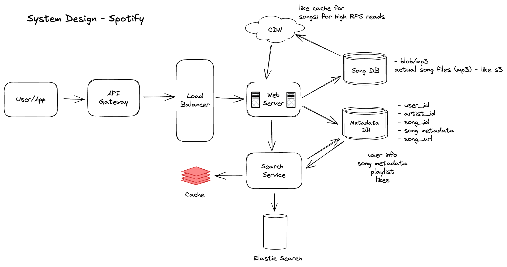

# Design Spotify

## Clarifications

- Limiting to finding and playing music
- How many active users
- How many total users?
  - 1B
- How many songs?
  - 100M
- How many artists?
  - 10M
- Size of song?
  - 5MB

## Functional Requirements

- user should be able to search songs
- user should be able to stream/play songs
- user should be able to upload songs
- user should be able to like songs
- user should be able to search users/artists

## Non-Functional Requirements

- high availability
- consistency
- low latency
- security
- privacy
- cost effective

## Estimations

- 1B users
- 100M songs
- 10M artists
- 5MB per song
- 100 songs per user
- Total storage required = 5MB \* 100M = 500TB = 0.5PB
- Replication: 3x
- Metadata: 100B _ 100M _ 3 = 300TB
- Total storage required = 500TB + 300TB = 800TB

## Design

### High Level Design

#### Components

- API Gateway
- Load Balancer
- CDN
- User Service
- Song Service
- Artist Service
- Search Service
- Database
- Cache

#### High Level Design

